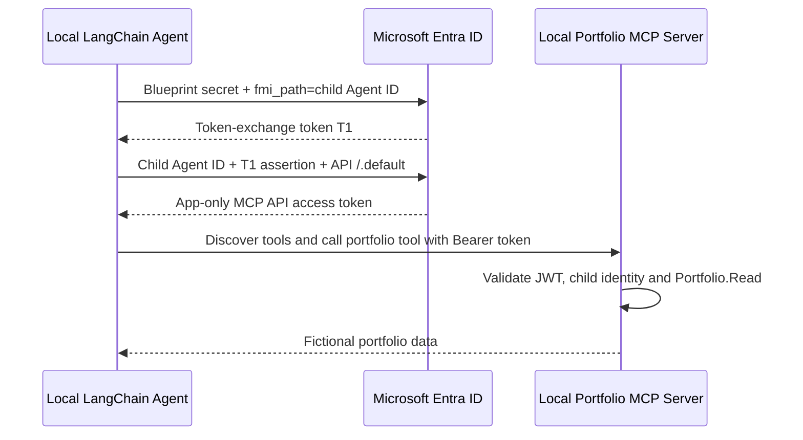

# Unattended Agent ID to Local MCP Demo

A local LangChain agent calls a local, protected MCP server using **Microsoft
Entra Agent ID**. Authentication has no user, browser, device code, or cached
Azure CLI login at runtime. Administrator sign-in is required only for setup.

The read-only `get_portfolio_summary` tool returns fictional holdings for
`DEMO-001`: equity $12,500, bonds $5,000, cash $2,500, total **$20,000 USD**.
Azure OpenAI summarizes that result; it is not financial advice or live data.

## Architecture



The blueprint is not the MCP caller: the final resource token identifies its
**child agent identity**. A normal app-registration client-credentials token is
not substituted for Agent ID. Azure OpenAI authentication remains separate and
uses your existing deployment and API key. All services need outbound internet
access for Entra discovery/keys, token acquisition, and model calls; only the MCP
server and agent processes run locally.

## Prerequisites

- Python 3.11+ (tested on Windows Python 3.14) and PowerShell 7.
- An Entra workforce tenant with Agent ID provisioning available. Confirm your
  tenant's current licensing, feature availability, and Conditional Access policy.
- An administrator permitted to create Agent ID blueprints/credentials and
  ordinary API app registrations, and grant the custom API's application role.
  Typically this requires Agent ID Administrator plus Cloud Application
  Administrator/Application Administrator. Tenant policy can require another
  admin to consent to the Graph PowerShell delegated permissions.
- Existing Azure OpenAI endpoint, key, and a deployment supporting tool calling.

```powershell
.\.venv\Scripts\python.exe -m pip install -r requirements.txt
Install-Module Microsoft.Graph.Authentication -Scope CurrentUser
```

The existing virtual environment can be reused. For a fresh checkout, create it
with `py -m venv .venv` first. The tested LangChain MCP adapter is a beta API;
direct dependencies are pinned to avoid accidentally mixing MCP v1 and v2 APIs.

## One-Time Tenant Setup

Use a dedicated development tenant. Review [scripts/setup_entra.ps1](scripts/setup_entra.ps1)
before running it: this script creates real tenant objects and grants access.

```powershell
.\scripts\setup_entra.ps1 -TenantId '<tenant-guid>' -WhatIf
$setup = .\scripts\setup_entra.ps1 -TenantId '<tenant-guid>'
```

Setup uses delegated Graph permissions for application creation, role assignment,
Agent ID creation, blueprint credentials, and reading the resulting objects. The
complete scope list is in the script. None of these Graph provisioning permissions
are granted to the runtime child identity or blueprint.

Setup creates/reuses an API application and service principal, a blueprint and
blueprint principal, and one child identity with the administrator as owner and
sponsor. The API requests **v2 access tokens** and the `idtyp` optional claim. It
defines the application role `Portfolio.Read` and assigns it directly to the child
identity. This assignment is the application-permission grant; delegated user
consent and `scp` permissions are not used. The API requires app-role assignment.

The default prefix is `FinancialAgentLocalDemo`. Use `-Prefix AnotherDemo` for an
independent set of resources. Repeating setup reuses objects and the role grant.
It refuses ambiguous names or a mismatched blueprint. Directory propagation can
temporarily make a newly created object unavailable; rerun after propagation.

The blueprint secret expires after seven days by default (`-SecretDays 1` through
`30`). It is set in the **current PowerShell process**, returned as a `SecureString`
in `$setup.ClientSecret`, and never printed or written to disk. Run the agent in
this shell. Repeated setup cannot retrieve the old secret; retain it securely, or
use `-NewSecret` to add a replacement. Rotation does not revoke the previous secret;
remove obsolete credentials in Entra after checking the replacement works.

Do not enable verbose HTTP tracing or PowerShell transcription around credentials.
Never paste secrets or tokens into chat, source control, screenshots, or token websites.

## Configuration

Use [.env.example](.env.example) as the setting reference. Your existing `.env`
is not changed by setup. Environment variables take precedence over that file.

| Setting | Used by |
| --- | --- |
| `ENTRA_TENANT_ID` | Agent and server; tenant GUID, never `common` |
| `ENTRA_AGENT_ID` | Agent and server; child identity ID/app ID, not blueprint ID |
| `MCP_API_CLIENT_ID` | Agent and server; API application client ID, not SP object ID |
| `ENTRA_BLUEPRINT_CLIENT_ID` | Agent only; blueprint application client ID |
| `ENTRA_BLUEPRINT_CLIENT_SECRET` | Agent only; local demo blueprint secret |
| `MCP_HOST`, `MCP_PORT` | Both; defaults `127.0.0.1`, `8000` |
| `AZURE_OPENAI_ENDPOINT`, `AZURE_OPENAI_API_KEY`, `AZURE_OPENAI_DEPLOYMENT_NAME` | Agent only; existing model settings |
| `OPENAI_API_VERSION` | Agent; keep your existing supported API version |

For a new shell, provide the secret locally using your secret manager or ignored
`.env`. The MCP server does **not** require the blueprint secret or model API key.

## Run the Demo

In **terminal 1**, set the three nonsecret IDs printed by setup and start the server:

```powershell
$env:ENTRA_TENANT_ID = '<tenant-guid>'
$env:ENTRA_AGENT_ID = '<child-agent-guid>'
$env:MCP_API_CLIENT_ID = '<api-client-guid>'
.\.venv\Scripts\python.exe mcp_server.py
```

In **terminal 2**, the shell where you ran setup, run:

```powershell
.\.venv\Scripts\python.exe financial_agent.py
```

Expect a summary containing the fixture's $20,000 total and a mock-data disclaimer.
Exact wording varies with the model. The first model turn is required to use a
tool; the program fails if it does not observe a successful portfolio tool result.
Server logs show the validated child identity, tenant, and role, never raw tokens.
The process exits after one run and can be invoked by Windows Task Scheduler;
the model's `user` message is a preconfigured job instruction, not an authenticated
human. No long-running scheduler is needed to demonstrate app-only authentication.

Use `MCP_PORT` in **both** terminals if port 8000 is already occupied. Binding to
nonloopback interfaces is rejected; there is no tunnel or public endpoint.

## Verify

```powershell
.\.venv\Scripts\python.exe -m pytest -q
.\tests\test_setup_entra.ps1
Invoke-RestMethod http://127.0.0.1:8000/.well-known/oauth-protected-resource/mcp
curl.exe -i -X POST http://127.0.0.1:8000/mcp -H 'Content-Type: application/json' -d '{}'
```

The metadata lists the tenant issuer and local MCP resource. The unauthenticated
POST returns `401` with a `WWW-Authenticate` header pointing to that metadata.
Tests cover both token exchanges, renewal and concurrency, signed JWT verification,
key rotation, discovery pinning, invalid identity/audience/tenant/expiry, `403` for
missing roles, and a real MCP HTTP transport plus LangChain graph with a fake model.
Provisioning tests use an in-memory Graph mock, not a real tenant.

For a live negative test, stop the server, temporarily set its `ENTRA_AGENT_ID` to
another GUID, restart, and run the unchanged agent. Expect rejection; restore the
original server setting afterward. This avoids changing actual tenant permissions.
Do not confuse offline tests with live proof: a real Entra-issued token, role grant,
and successful Azure OpenAI run must still be verified in your tenant.

## Authentication Boundaries

- Tokens are acquired by the documented two-stage autonomous app flow, cached in
  memory and renewed before expiry. Client credentials flows do not use refresh tokens.
- JWT validation uses PyJWT and cached Entra signing keys, including unknown-key
  refresh. The verifier pins RS256, v2 issuer, tenant, API audience, child `oid`/`azp`,
  and `idtyp=app`; delegated `scp` tokens are rejected. Invalid tokens receive `401`.
- Entra application `roles` map into the SDK's authorization scopes; a valid token
  without `Portfolio.Read` receives `403`. Every MCP HTTP request is protected.
- The token scope is `api://<API-client-id>/.default`, while a **v2 token audience
  is the API client-ID GUID**, not the scope or localhost URL.
- RFC 9728 metadata identifies `http://127.0.0.1:8000/mcp`. The verifier, not the
  SDK's URL comparison, enforces the Entra audience. This is a preconfigured Entra
  bearer integration with MCP metadata, **not** a claim of generic OAuth discovery
  interoperability or full MCP client-credentials extension conformance. App roles
  in the SDK metadata are authorization labels, not delegated Entra scopes to request.
- The client disables redirects and only attaches MCP tokens to the configured
  resource. Blueprint secrets and T1 are sent only to the Entra token endpoint.
- Plain HTTP is a loopback-only development exception. Use HTTPS outside the local
  demo. In production, prefer Microsoft's Agent ID Auth SDK/sidecar and managed
  identity federation or a certificate over the manual exchange and demo secret.
- Disabling an identity or removing a role does not necessarily invalidate already
  issued JWTs immediately. Do not promise instant revocation from offline validation.

## Troubleshooting

| Symptom | Check |
| --- | --- |
| Setup forbidden | Agent ID availability, active admin roles and consent to the script's Graph scopes |
| `invalid_client` | Blueprint client ID, secret value (not secret ID), expiration, and tenant |
| Exchange rejected | Child belongs to that blueprint; `fmi_path` uses the child ID; conditional access allows app-only access |
| Resource token denied | Direct `Portfolio.Read` grant to child, API service principal and assignment propagation |
| MCP `401` | v2 issuer, `idtyp` optional claim, child `oid`/`azp`, API GUID audience, clock, signing-key connectivity |
| MCP `403` | The final token has the `Portfolio.Read` application role; it is not a delegated `scp` permission |
| Model error | Existing Azure OpenAI key/endpoint, API version, deployment and tool-calling support |

Client token errors include only a sanitized OAuth error code, stage and correlation
ID. Check Entra agent sign-in logs with that correlation ID. Do not log raw exception
payloads or HTTP request/response bodies during credential troubleshooting.

## Cleanup

Stop the local server. In Entra, identify the objects by the chosen prefix and the
IDs in `$setup`: delete the child agent, then the blueprint and its principal, and
the dedicated MCP API app/service principal. Only delete objects created for this
demo; blueprint deletion can affect all its child identities. Remove locally stored
demo credentials and any consent granted to Graph PowerShell solely for this demo.
Tenant agent inventory/Agent 365 registry integration is not implemented here.

## References

- [Agent autonomous app OAuth flow](https://learn.microsoft.com/en-us/entra/agent-id/agent-autonomous-app-oauth-flow)
- [Create a blueprint](https://learn.microsoft.com/en-us/entra/agent-id/create-blueprint)
- [Create agent identities](https://learn.microsoft.com/en-us/entra/agent-id/create-delete-agent-identities)
- [Microsoft access-token validation](https://learn.microsoft.com/en-us/entra/identity-platform/access-tokens)
- [MCP client credentials extension](https://modelcontextprotocol.io/extensions/auth/oauth-client-credentials)
- [LangChain MCP authentication](https://docs.langchain.com/oss/python/langchain/mcp/auth)